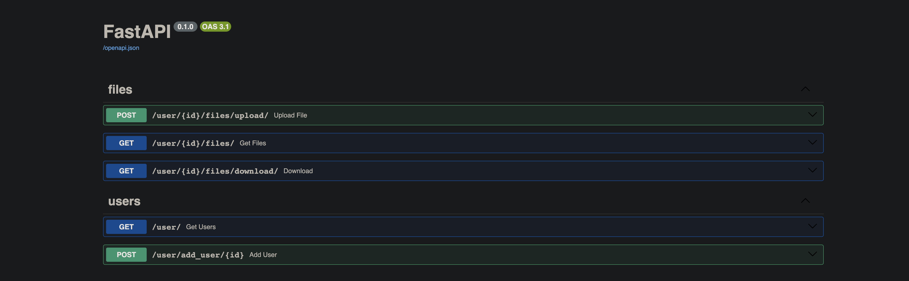

## Simple rest api service for converting files to pdf
stack: Python 3.12, FastAPI, Pydantic, Alembic, SqlAlchemy, PostgreSQL, Redis, PyTest, Uvicorn



### File Structure 

```
├── src 
│   ├── app
│   │  ├── api - Modules responsible for handling API requests.
│   │  │  ├── dependencies - Modules for managing API dependencies, such as authentication or authorization.
│   │  │  ├── errors - Modules for handling API errors, such as HTTP errors.
│   │  │  └── views - View modules responsible for processing requests and returning responses to the client.
│   │  ├── core - Core components of the application.
│   │  │  └── settings - Application settings, such as database settings or configuration parameters.
│   │  ├── db - Modules related to the database.
│   │  │  ├── migrations - Folder containing migrations for managing database changes.
│   │  │  │  └── versions - Files containing migrations in different versions.
│   │  │  ├── pdf_storage - Folder for storing PDF files.
│   │  │  └── repositories - Repositories for interacting with the database.
│   │  ├── models - Data models of the application.
│   │  │  ├── domains - Domain object models.
│   │  │  └── schemas - Data schemas for validating API requests and responses.
│   │  └── services - Services implementing the business logic of the application.
│   │      └── exceptions - Custom exceptions and error handling.
│   └── utils - Utilities and helper modules.
└── test - This folder contains modules for testing your application.
├── data - This directory can contain test or temporary data for your application.
├── pytest - Configuration files or additional settings for testing using pytest.
└── unittest - Configuration files or additional settings for testing using unittest.
```
